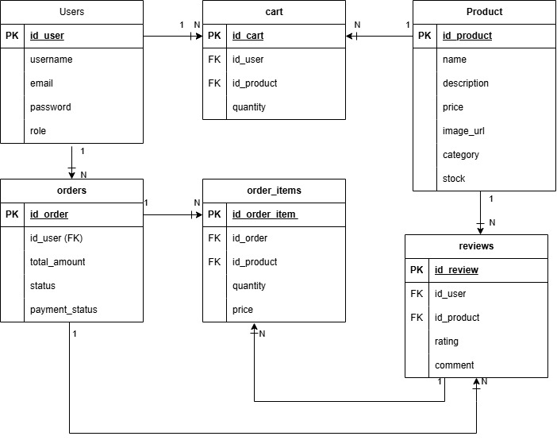

# Laporan Progres Mingguan - SICATE
**Kelompok**: 8

**Nama Anggota Kelompok**: 1. Andini Permata Sari (10231015)

2. Chelsy Olivia (10231025)

3. Jonathan Cristopher Jetro (10231047)

4. Nicholas Christian Samuel Manurung (10231069)

**Mitra**: Toba Home Catering

**Pekan ke-**: 10

**Tanggal**: 18/04/2025

**Nama Anggota Kelompok**: 1. Andini Permata Sari (10231015)
2. Chelsy Olivia (10231025)
3. Jonathan Cristopher Jetro (10231047)
4. Nicholas Christian Samuel Manurung (10231069)

## Progress Summary
Progres pada minggu ini dilanjutkan dengan merancang skema database berdasarkan kebutuhan fitur MVP, lalu mengimplementasikannya ke dalam PostgreSQL untuk memastikan data tersimpan dengan baik dan terstruktur. Setelah itu, tim membuat kerangka dasar REST API untuk menangani endpoint utama serta menyiapkan struktur awal antarmuka pengguna pada sisi frontend. Seluruh progres tersebut kemudian didemokan kepada mitra untuk mendapatkan masukan dan validasi pengembangan sistem.

## Accomplished Tasks
- Merancang skema database (ERD diagram) dan mengimplementasikan ke dalam PostgreSQL
- Membuat Endpoint dasar (POST & GET)
- Menyiapkan struktur frontend basic

## Challenges & Solutions
- **Challenge 1**: Tim kesulitan dalam membuat halaman frontend karena perlu menyesuaikan desain dengan fungsionalitas yang direncanakan.
  - **Solution**: Solusinya adalah mencari eror pada website untuk mengetahui letak eror nya lalu menelusuri sumber masalahnya agar dapat segera diperbaiki.

## Next Week Plan
- Mengimplementasikan sistem autentikasi (Login dan Registetr)
- Implementasi fitur inti #1 (sesuai kebutuhan mitra)
- Integrasi frontend-backend untuk fitur yang sudah ada
- Demo progress ke mitra

## Contributions
- **Chelsy Olivia**: Membuat laporan (Md), membuat ERD
- **Andini Permata Sari**: Membantu membuat laporan (Md), membantu membuat ERD
- **Jonathan Cristopher Jetro**: Membuat struktur database, membuat frontend dan backend skeleton
- **Nicholas Christian Samuel Manurung**: Tidak Aktif

## Screenshots
## 1. Skema Database (ERD Dia)

Skema database pada diagram tersebut menggambarkan sistem e-commerce yang terdiri dari enam entitas utama: users, products, cart, orders, order_items, dan reviews. Setiap entitas saling terhubung untuk merepresentasikan proses bisnis dari pengguna yang berinteraksi dengan produk, melakukan pembelian, serta memberikan ulasan.

Entitas users menyimpan data pengguna seperti username, email, password, dan role. Seorang user dapat menambahkan banyak produk ke dalam keranjang (cart), yang setiap itemnya mengacu pada satu produk tertentu dari entitas products. Produk sendiri memiliki atribut seperti name, description, price, dan stock. Ketika pengguna melakukan pembelian, data pesanan disimpan dalam entitas orders, yang mencatat total harga, status, dan status pembayaran. Satu order bisa memiliki beberapa item pesanan (order_items), masing-masing menghubungkan produk yang dibeli dalam jumlah tertentu beserta harga pada saat transaksi.

Setelah pembelian, pengguna dapat memberikan penilaian atau ulasan terhadap produk melalui entitas reviews. Setiap review mencatat rating dan comment, serta menghubungkan user dengan produk yang diulas. Seluruh relasi antar entitas menggunakan model one-to-many (1:N), yang berarti satu entitas utama seperti user atau produk bisa terhubung ke banyak entitas terkait seperti cart, orders, order_items, dan reviews.

## 2. REST API skeleton (endpoint dasar)

Untuk lebih jelas bisa dibuka di repositori berikut TubesProwebA8\ecommerce-backend\docs\API.md

## 3. Struktur Frontend Basic

Pada gambar diatas merupakan awalan untuk aplikasi web yang bernama SI CATE yang berfungsi untuk melihat produk makanan catering. Bisa dilihat pada gambar, progres awalan sudah terdapat menu navigasi yang terdiri dari Produk, Keranjang, dan Pesanan serta di sisi kanan terdapat opsi Profile dan Logout yang menandakan bahwa pengguna telah masuk ke dalam akun mereka.Secara keseluruhan, halaman ini menampilkan tampilan katalog produk yang berisi nama makanan dan harga.
