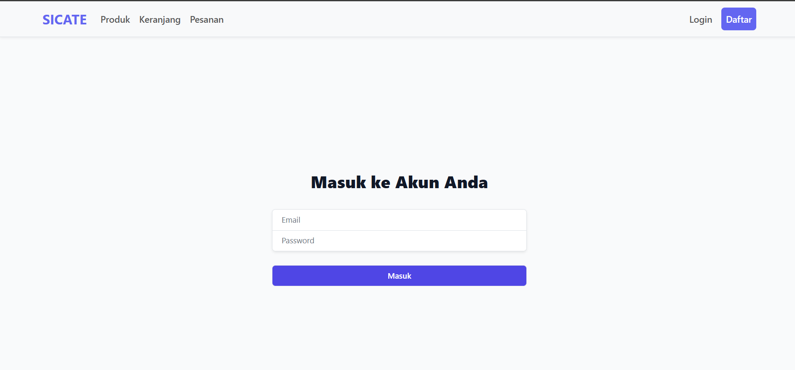
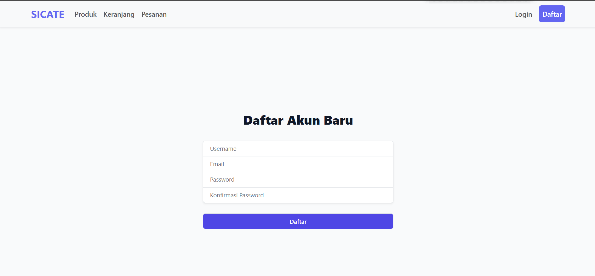
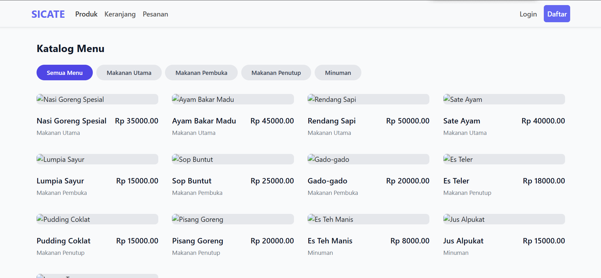
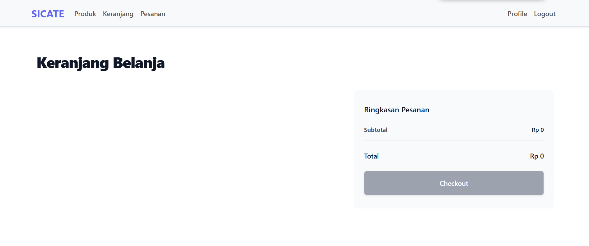

# Laporan Progres Mingguan - SICATE
**Kelompok**: 8

**Nama Anggota Kelompok**: 
1. Andini Permata Sari (10231015)

2. Chelsy Olivia (10231025)

3. Jonathan Cristopher Jetro (10231047)

4. Nicholas Christian Samuel Manurung (10231069)

**Mitra**: Toba Home Catering

**Pekan ke-**: 11

**Tanggal**: 25/04/2025

## Progress Summary
Pada minggu ini, tim telah mengimplementasikan sistem autentikasi pada website yang mencakup fitur login dan register. Selain itu, kami juga mulai mengembangkan fitur inti pertama sesuai kebutuhan mitra, yaitu katalog produk yang menampilkan informasi seperti nama dan harga produk. Fitur tambahan seperti keranjang dan pesanan juga mulai ditambahkan untuk mendukung proses transaksi. Seluruh fitur yang telah dikembangkan diintegrasikan antara frontend dan backend agar dapat berjalan dengan baik. Progres ini kemudian didemokan kepada mitra untuk mendapatkan masukan dan validasi lebih lanjut terkait pengembangan sistem.

## Accomplished Tasks
- Implementasi sistem autentikasi (login/register)
- Implementasi fitur inti #1 (sesuai kebutuhan mitra)
- Integrasi frontend-backend untuk fitur yang sudah ada
- Demo progress ke mitra

## Challenges & Solutions
- **Challenge 1**: Tim kesulitan dalam pembuatan fitur utama, terutama pada bagian implementasi kode. Beberapa kendala muncul saat menghubungkan frontend dan backend, serta saat memastikan data dapat ditampilkan dan diproses dengan benar. Tim masih perlu waktu untuk memahami alur dan menyesuaikan logika program agar sesuai dengan kebutuhan mitra.
- **Solution**: Solusinya adalah memperjelas kebutuhan dan alur kerja fitur tersebut melalui wireframe atau diagram sederhana. Tim bisa mulai dengan membuat alur yang jelas, supaya anggota paham dengaan  bagaimana alurnya berjalan

## Next Week Plan
- Implementasi fitur inti #2 dan #3
- Penyempurnaan UI/UX
- Pengujian integrasi
- Demo progress ke mitra

## Contributions
- **Chelsy Olivia**: Membuat laporan (Md) 
- **Andini Permata Sari**: Implementasi sistem autentikasi (login/register)
- **Jonathan Cristopher Jetro**: Implementasi fitur inti #1 (sesuai kebutuhan mitra)
- **Nicholas Christian Samuel Manurung**: Integrasi frontend-backend untuk fitur yang sudah ada

## Screenshots 
### 1. Implementasi sistem autentikasi (Login & Register)
#### Halaman Masuk

 Pada gambar diatas menampilkan halaman masuk (login) dari Web yang sudah kami buat yaitu SI CATE. Pada bagian atas halaman kiri terdapat menu navigasi dengan piliha produk, keranjang dan pesanan serta pada bagian pojok kanan atas terdapat 2 tombol untuk login. Di bagian tengah halaman, terdapat semaacam formulir untuk pengguna untuk memasukkan alamat email dan kata sandi sebelum masuk ke dalam web untuk mengakses lebih lanjut.

#### Halaman Daftar

Pada gambar diatas menampilkan halaman pendaftaran akun baru untuk membuka SICATE. Di tengah halaman terdapat isian yang meminta pengguna untuk mengisi username, email, password dan konfirmasi password. Setelah di isi, pengguna dapat menekan tombol daftar untuk membuat akun SICATE

### 2. Implementasi fitur inti #1 (katalog, keranjang dan pesanan)
#### Halaman Katalog

Pada gambar diatas menampilkan halaman katalog menu dari SICATE yang beerisis daftar makanan dan minuman lengkap dengan harga dan juga kategoru seperti makanan utama, makanan pembuka, makanan penutup dan minuman. Jadinya pengguna bisa memiloh kategori makanan sesuai keinginan sebelum membeli. Setiap item menampilkan nama, gambar (yang belum dimasukka), kategori dan harga. Pada gambar diatas belum nama makanan yang pasti dan masih termasuk data dami.

#### Halaman keranjang

Gambar diatas menampilkan halaman keranjang belanja dari SICATE. Halaman ini digunakan untuk menampilkan daftar produk yang sudah dipilih oleh pengguna. Pada sisi kanan terdapat ringkasan pesanan yang mencantumkan subtotal dan total belanja, pada gambar masih Rp. 0 karena belum ada item produk makanan ditambahkan dan juga terdapat tombol checkout untuk melanjutkan proses pembayaran.

#### Halaman pesanan

 Pada gambar diatas menampilkan halaman riwayat pesanan dari SICATE. Halaman ini berfungsi untuk menampilkan daftar transaksi yang sudah pernah dilakukan oleh pengguna. tabel yang tersedia yaitu id pesanan, tanggal, total, status dan status pembayaran. Pada gambar belum menampilkan data karena belum ada riwayat pesanan yang tercatat.

### 3. Integrasi frontend-backend untuk fitur yang sudah ada

Gambar di atas merupakan hasil dari pengujian integrasi antara antarmuka pengguna (frontend), sistem backend, dan database dalam pengelolaan data produk makanan. Data yang ditampilkan menunjukkan bahwa proses input produk, seperti nama, deskripsi, harga, URL gambar, kategori, dan jumlah stok, telah berhasil tersimpan dengan baik ke dalam database. Selain itu, kolom created_at dan updated_at yang otomatis terisi menunjukkan bahwa fitur pencatatan waktu dari sisi backend juga berfungsi dengan baik. Hal ini membuktikan bahwa seluruh komponen sistem telah terintegrasi secara efektif, mulai dari proses input oleh pengguna, pemrosesan data oleh sistem, hingga penyimpanan ke database. Dengan demikian, gambar ini dapat dijadikan sebagai bukti bahwa tes integrasi telah berhasil dilakukan dan sistem berjalan sesuai fungsinya.
