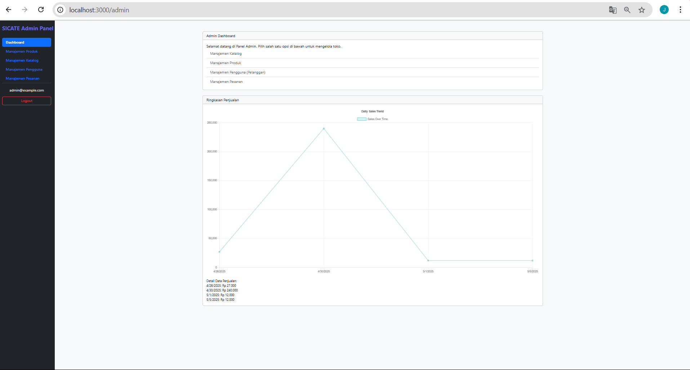

# Laporan Progres Mingguan - SICATE
**Kelompok**: 8

**Nama Anggota Kelompok**: 
1. Andini Permata Sari (10231015)

2. Chelsy Olivia (10231025)

3. Jonathan Cristopher Jetro (10231047)

4. Nicholas Christian Samuel Manurung (10231069)

**Mitra**: Toba Home Catering

**Pekan ke-**: 13

**Tanggal**: 09/05/2025

## Progress Summary
Pada minggu ini, tim kami telah mengimplementasikan fitur inti #4 yang mencakup fitur untuk admin seperti manajemen katalog, manajemen produk, manajemen pesanan, dan manajemen pengguna. Selain itu, programmer juga membangun admin panel sederhana berupa dashboard serta menambahkan visualisasi data untuk memperjelas informasi yang relevan. Progres yang telah dicapai kemudian didemokan kepada mitra untuk memperoleh masukan dan validasi lebih lanjut.

## Accomplished Tasks
- Implementasi fitur inti #4
- Pembuatan admin panel sederhana (dashboard)
- Visualisasi data sederhana (jika relevan)
- Demo progress ke mitra

## Challenges & Solutions
- **Challenge 1**: Tim kami kesulitian dalam penggunaan fungsi gate atau patch dalam menampilkan gambar di website.
- **Solution**: Mencari error lalu memperbaikinya dengan teliti

## Next Week Plan
- Penyempurnaan seluruh fitur
- Bugfixing
- Usability testing
- Persiapan deployment (jika diperlukan)
- Demo progress ke mitra

## Contributions
- **Chelsy Olivia**: Membuat laporan mingguan
- **Andini Permata Sari**: membantu programmer dalam mengimplementasikan fitur inti #4
- **Jonathan Cristopher Jetro**: Mengimplementasikan fitur inti #4 dan pembuatan admin panel sederhana (dashboard) untuk pengelolaan data
- **Nicholas Christian Samuel Manurung**: Mendemokan progress ke mitra
  
## Screenshots 
## 1. Halaman admin panel (dashboard)

Pada gambar diatas menampilkan dashboard dari web kami yaitu SICATE ( SICATE Admin Panel), yaitu halaman utama saat admin pertama kali masuk ke sistem. Pada bagian kiri tampilan, terdapat menu navigasi seperti Manajemen Produk, Manajemen Katalog, Manajemen Pengguna, dan Manajemen Pesanan yang bisa dipilih untuk mengelola.

Pada bagian tengah halaman, terdapat sambutan "Selamat datang di Panel Admin" dan beberapa tombol untuk langsung menuju ke bagian pengelolaan yang tersedia. Di bawahnya, ada grafik berjudul “Daily Sales Trend” yang menampilkan data penjualan harian dalam bentuk garis. Grafik ini membantu admin melihat bagaimana perkembangan penjualan dari hari ke hari. Di bagian kiri bawah grafik juga ditampilkan detail angka penjualan per tanggal, seperti "4/28/2025 Rp 27.000" dan seterusnya. Halaman ini dibuat agar admin bisa langsung melihat gambaran umum performa penjualan dan mudah memilih bagian mana yang ingin dikelola.

## 2. Halaman manajemen katalog

Pada gambar diatas menampilkan manajemen katalog dari web kami yaitu SICATE( SICATE Admin Panel), yang digunakan untuk mengatur kategori produk yang tersedia di sistem. Pada bagian ataas tampilan, terdapat kolom untuk menambahkan kategori baru, misalnya jika admin ingin menambah jenis makanan atau minuman baru, tinggal mengetikkan namanya lalu klik tombol "Tambah" berwarna hijau. Di bawahnya, ada daftar kategori yang sudah tersedia, seperti Makanan Berat, Makanan Pembuka, Makanan Penutup, dan sebagainya. Setiap kategori memiliki dua tombol: "Edit" untuk mengubah nama kategori, dan "Hapus" untuk menghapus kategori tersebut dari sistem. Halaman ini memudahkan admin untuk menambah, mengubah, atau menghapus jenis-jenis produk agar katalog tetap rapi dan sesuai dengan kebutuhan.

## 3. Halaman manajemen produk

Pada gambar diatass menampilkan manajemen produk dari web kami yaitu SICATE ( SICATE Admin Panel) yang digunakan admin  untuk mengelola daftar produk yang tersedia di sistem. pada bagian atas tampilan, terdapat fitur filter untuk menampilkan produk berdasarkan kategori tertentu, serta pilihan untuk mengurutkan data berdasarkan ID produk atau kriteria lainnya. Di bagian kanan atas, ada tombol “Tambah Produk Baru” yang digunakan untuk menambahkan produk baru ke dalam sistem.

Di bawahnya, terdapat tabel yang menampilkan informasi lengkap dari setiap produk, seperti ID, gambar produk, nama produk (contohnya "Nasi Kotak Ayam Goreng", "Tumpeng Mini", dan lain-lain), harga, jumlah stok yang tersedia, kategori produk, serta dua tombol aksi yaitu Edit untuk mengubah data produk dan Hapus untuk menghapus produk dari sistem. Halaman ini dibuat agar admin bisa dengan mudah melihat dan mengatur data produk, termasuk menambah, mengedit, atau menghapus produk kapan saja. Dengan tampilan ini, pengelolaan produk menjadi lebih terstruktur dan mudah dipahami, bahkan oleh orang yang baru belajar.

## 4. Halaman manajemen pesanan

Pada gamabar diatas menampilan manajemen pesanan dari web kami yaitu SICATE ( SICATE Admin Panel) dan halaman ini digunakan oleh Admin untuk mengatur dan melihat pesanan dari pelangga/ccostomer. Pada bagian atas tampilan, terdapat fitur filter untuk menyaring pesanan berdasarkan stautus pembayaran, status pesanan dan urutan berdasarkan tanggal. Tujuannya adalah agar admin bisa menemukan data pesanan pelanggan dengan cepat dan mudah. Di bagian bawahnya, terdapat tabel yang menampilkan daftar pesanan. Informasi yang ditampilkan meliputi ID pesanan, nama pelanggan, tanggal pemesanan, tanggal pesanan selesai, total harga, status pesanan (misalnya “Selesai”), status pembayaran (misalnya “Pembayaran sudah dilakukan”), serta tombol “Kelola” untuk melihat atau mengubah detail pesanan tersebut.

Contohnya, semua pesanan pada gambar ini dibuat oleh pelanggan bernama Jetro pada tanggal 8 Mei 2025 dan selesai pada 10 Mei 2025, dengan status yang menunjukkan pesanan sudah selesai dan pembayaran sudah dilakukan. Halaman ini membantu admin untuk memantau dan mengelola pesanan yang masuk dengan lebih teratur dan efisien.

## 5. Halaman manajemen pengguna

Pada gambar diatas menampilkan halaman dari web kami yaitu SICATE Admin Panel, pada halaman ini dibuat khusus untuk digunakan oleh admin untuk mengelola data pengguna. Di bagian kiri tampilan terdapat menu navigasi yang memungkinkan admin berpindah ke bagian sistem lainnya seperti dashboard, manajemen produk, manajemen katalog, manajemen pengguna dan manajemen pesanan. Fokus utama dari halaman ini yaitu tabel manajemen pengguna yang ada pada tengah tampilan. Pada tabel berisi informasi penting tentang pengguna, seperti ID, username, email, peran (role) mereka dalam sistem seperti "customer" atau "admin", tanggal mereka mendaftar serta tombol "Hapus" yang digunakan untuk menghapus pengguna dari sistem jika diperlukan. 

Contohnya, pengguna bernama Jetro yang memiliki peran sebagai customer dan mendaftar pada tanggal 26 April 2025, sedangkan pengguna lainnya bernama Admin berperan sebegai administrator dan terdaftar dan terdaftar sehari sebelumnya. Halaman dibuat agar admin dapat dengan mudah melihatm memantau dan mengatur pengguna dalam sistem. 