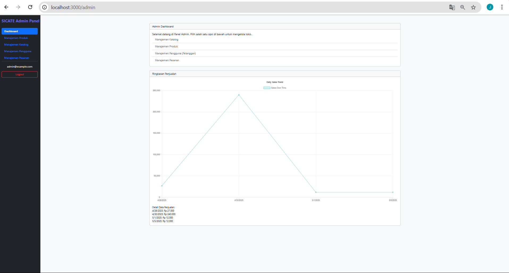

# Laporan Progres Mingguan - SICATE
**Kelompok**: 8

**Nama Anggota Kelompok**: 
1. Andini Permata Sari (10231015)

2. Chelsy Olivia (10231025)

3. Jonathan Cristopher Jetro (10231047)

4. Nicholas Christian Samuel Manurung (10231069)

**Mitra**: Toba Home Catering

**Pekan ke-**: 14

**Tanggal**: 16/05/2025

## Progress Summary
Pada minggu ini, tim kami telah melakukan penyempurnaan terhadap seluruh fitur yang telah dikembangkan guna memastikan setiap fungsionalitas berjalan dengan baik dan sesuai kebutuhan. Selain itu, tim kami juga melakukan perbaikan terhadap satu bug yang ditemukan selama proses pengujian, serta melakukan usability testing untuk menilai sejauh mana sistem dapat digunakan dengan nyaman dan mudah oleh pengguna. Progres yang telah dicapai kemudian didemokan kepada mitra untuk memperoleh masukan dan validasi akhir, serta dilakukan persiapan untuk deployment apabila diperlukan pada tahap selanjutnya.

## Accomplished Tasks
- Penyempurnaan seluruh fitu
- Bugfixing
- Usability testing
- Persiapan deployment (jika diperlukan)
- Demo progress ke mitra

## Challenges & Solutions
- **Challenge 1**: 
- **Solution**: 

## Next Week Plan
- Presentasi final ke mitra dan dosen
- Dokumentasi lengkap (README, API docs, user manual)
- Penyerahan kode sumber dan deployment
- Evaluasi proyek dan lessons learned

## Contributions
- **Chelsy Olivia**: 
- **Andini Permata Sari**: 
- **Jonathan Cristopher Jetro**: a
- **Nicholas Christian Samuel Manurung**: 
  
## Screenshots 
### 1. Daftar bug pada SICATE
#### a. Bug Feedback

Pada halaman feedback terjadi bug yaitu ketika saat menginput feedback, feedback nya tidak tertampil di admin panel. Untuk solusinya sendiri, karena halaman feedbacknya masih belum terhubung dengan database, jadi kami perlu membuat tabel di database untuk feedback

### 2. Hasil pengujian dengan minimal 3 user
### a. User 1
#### - Halaman Login
#### - Berhasil mencoba memasukan menu ke keranjang
#### - Membuka detail menu
#### - Membuka halaman keranjang
#### - Memesan Produk
#### - Melihat halaman riwayat pesanan

### b. User 2
#### - Halaman Login
#### - Memasukkan produk ke keranjang
#### - Berhasil memasukkan produk ke keranjang
#### - Menampilkan halaman keranjang
#### - 

### 3. Data Visualization: grafik sederhana

