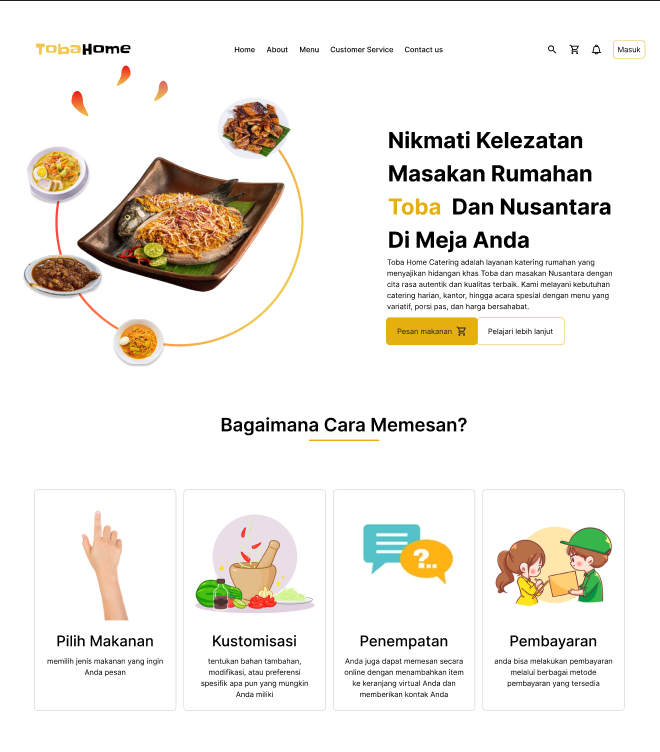
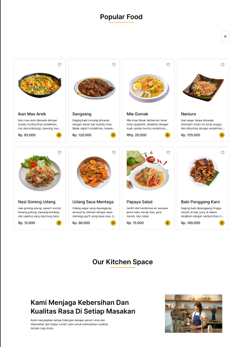
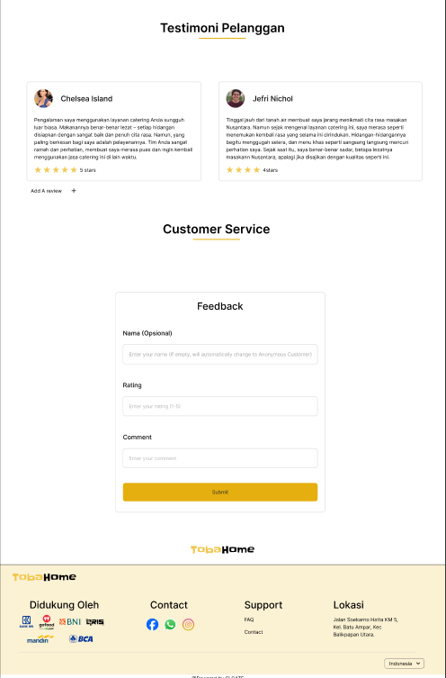
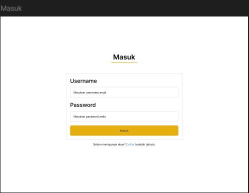
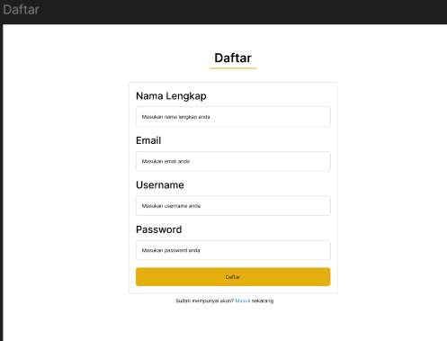
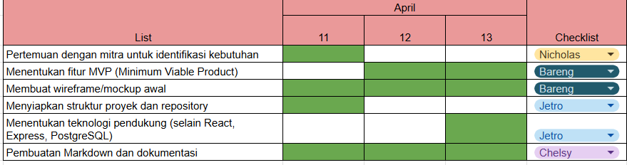

# Laporan Progres Mingguan - SICATE
**Kelompok**: 8

**Mitra**: Toba Home Catering

**Pekan ke-**: 9

**Tanggal**: 12/4/2025

## Progress Summary
Proses pengembangan diawali dengan pertemuan bersama mitra untuk mengidentifikasi kebutuhan utama sistem, di mana mitra merupakan pelaku usaha catering yang membutuhkan sistem informasi berbasis website bernama SI CATE untuk mempermudah proses pemesanan dan pengelolaan operasional. Berdasarkan hasil diskusi kelompok kami, ditetapkan fitur-fitur MVP yang terdiri dari daftar, masuk, katalog, keranjang, pemesanan, pembayaran, dan status pesanan, lalu dilanjutkan dengan pembuatan wireframe awal. Tim kemudian menyiapkan struktur proyek dan repository, serta menentukan teknologi pendukung tambahan seperti xxx untuk manajemen gambar produk.
<<<<<<< HEAD
=======

>>>>>>> 2b0d1e08b18e08d4f1ee3281dc3e933b176cb278

## Accomplished Tasks
- Deskripsi kebutuhan mitra, menentukan fitur-fitur MVP, dan timeline
- Membuat desain awal UI aplikasi
- Membuat struktur proyek awal dengan README

## Challenges & Solutions
- **Challenge 1**: Tim mengalami kesulitan saat mendesain mockup karena masih belum terbiasa menggunakan Figma dan belum memiliki gambaran pasti tentang tampilan website yang ingin dibuat.
- **Solution**: Untuk mengatasinya, tim mulai mempelajari dasar penggunaan Figma melalui tutorial online dan mencari referensi desain sebagai inspirasi tampilan website.
- **Challenge 2**: Saat menganalisis kebutuhan mitra dan menentukan fitur-fitur website, tim mengalami kesulitan karena belum sepenuhnya memahami prioritas dan kebutuhan utama mitra.
- **Solution**: Untuk mengatasinya, tim melakukan diskusi lanjutan dengan mitra serta menyusun daftar kebutuhan berdasarkan urgensi, sehingga fitur yang dirancang bisa lebih relevan dan tepat guna.

## Next Week Plan
<<<<<<< HEAD
=======
- Membuat skema database (ERD) yang akan diimplementasikan
>>>>>>> 2b0d1e08b18e08d4f1ee3281dc3e933b176cb278
- Membuat skema (ERD) database yang akan diimplementasikan
- Mengimplementasikan struktur database di PostgreSQL
- Membuat REST API skeleton (endpoint dasar)
- Menyiapkan struktur frontend basic
- Melakukan demo progress ke mitra
  
## Contributions
- **Andini Permata Sari**: Menentukan fitur MVP (Minimum Viable Product), Membuat wireframe/mockup awal 
- **Chelsy Olivia**: Menentukan fitur MVP (Minimum Viable Product), Membuat wireframe/mockup awal, Pembuatan Markdown dan dokumentasi/screenshoot
- **Jonathan Cristopher Jetro**: Menentukan fitur MVP (Minimum Viable Product), Membuat wireframe/mockup awal, Menyiapkan struktur proyek dan repository, Menentukan teknologi pendukung (selain React, 
Express, PostgreSQL)
- **Nicholas Christian Samuel Manurung**: Menentukan fitur MVP (Minimum Viable Product), Membuat wireframe/mockup awal

## Screenshots Mockup 
Berikut adalah design awal proyek aplikasi SI CATE. Mockup yang kami buat menampilkan halaman utama Toba Home Catering yang berisi penjelasan singkat tentang layanan katering, gambar makanan khas Toba, serta katalog produk populer. Selain itu, tersedia panduan cara pemesanan, testimoni pelanggan, fitur customer service berupa formulir, serta halaman masuk dan daftar untuk pelanggan dan admin. Pada minggu ini, kami baru menyelesaikan desain awal, sementara pengembangan fitur lainnya akan dilanjutkan di minggu berikutnya

## Timeline Minggu9

<<<<<<< HEAD
=======

>>>>>>> 2b0d1e08b18e08d4f1ee3281dc3e933b176cb278
